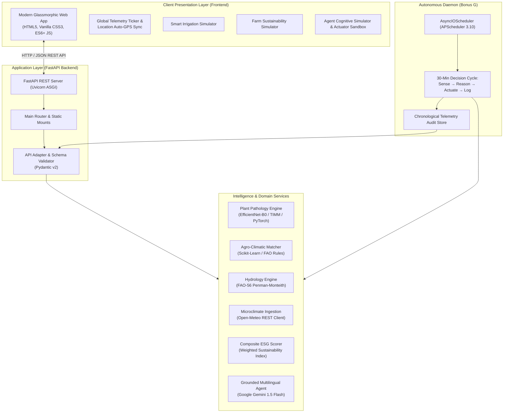

# 🌾 AgriSmart AI — Intelligent Autonomous Farming Advisor

> **Autonomous Multi-Agent Precision Agriculture & Crop Diagnostics Platform**  
> *Smart India Hackathon (SIH) 2026 | Problem Statement: C-433*

[](https://fastapi.tiangolo.com)
[](https://python.org)
[](https://pytorch.org)
[](https://aistudio.google.com)
[](https://open-meteo.com)
[](LICENSE)

---

## 📖 Executive Summary

**AgriSmart AI** is a next-generation, autonomous precision agriculture platform engineered to bridge the gap between complex agronomic science and everyday farm operations. 

Unlike traditional farming dashboards that require constant human oversight and manual data entry, AgriSmart AI acts as an **autonomous digital farm manager**. It combines **computer vision plant pathology**, **FAO-56 hydrologic models**, **hyper-local satellite meteorological intelligence**, and **background agentic autonomous loops** to monitor fields, detect diseases, optimize water resources, and command physical farm actuators (such as smart drip valves, solar pumps, and drone sprayers) in real time.

---

## 🏗️ System Architecture & Data Flow



---

## 💻 Technology Stack

### Frontend
* **Core:** Semantic HTML5, Vanilla JavaScript (ES6+ modular architecture), no bulky framework overhead for blazing fast mobile performance.
* **Styling:** Curated Vanilla CSS Design System with HSL color tokens, glassmorphism, responsive grid layouts, and custom micro-animations (`dotPulse`, `pulseGlow`).
* **Visualizations:** Custom SVG circular gauges, dynamic SVG linear scorebars, responsive multi-column layouts.
* **Resilience:** Built-in offline fallback engine (`mock-data.js`) ensuring all simulations, charts, and calculations function seamlessly even without internet access or backend downtime.

### Backend & AI/ML
* **Framework:** **FastAPI 0.111** running on **Uvicorn ASGI** with asynchronous endpoints and auto-generated OpenAPI/Swagger interactive documentation (`/docs`).
* **Plant Pathology (Core):** **PyTorch 2.3+** with **TIMM (PyTorch Image Models)** utilizing fine-tuned **EfficientNet-B0** deep convolutional neural networks trained on PlantVillage benchmark datasets. Supports both GPU acceleration and lightweight deterministic stub inference (`MODEL_MODE=mock`).
* **Large Language Model (Bonus E):** **Google Gemini 1.5 Flash** integrated via `google-generativeai`, featuring farm telemetry grounding for context-aware agronomic consulting across 10 Indian regional languages.
* **Autonomous Scheduling (Bonus G):** **APScheduler 3.10+ (`AsyncIOScheduler`)** running persistent background farm monitoring loops.
* **Weather Service (Bonus C):** High-resolution hyper-local forecasts powered by **Open-Meteo** (no API keys required, WMO weather standards).
* **Data Validation:** **Pydantic v2** strict typing schemas.

---

## 📑 Complete Feature Breakdown (A to Z by Page / Module)

---

### 🌐 Global Header & Navigation Ticker
* **High-Precision GPS Location Auto-Detection:** Automatically detects the farm's latitude, longitude, city, and district via HTML5 Geolocation and IP fallback; supports manual coordinate overrides.
* **Live Environmental Ticker:** Always-visible status bar showing Current Agro-Zone, Soil Moisture (%), Ambient Temperature (°C), and 24h Rain Chance (%).
* **Offline / Online Telemetry Indicator:** Visual badge displaying whether the system is operating in live backend mode or offline simulated fallback mode.
* **Unread Agent Notifications Badge:** Dynamically updates with total recorded events dispatched by the autonomous background daemon.
* **Responsive Multi-Device Navigation:** Tab bar with icon headers on desktop; touch-optimized fixed bottom navigation bar on mobile.

---

### Section 1: 🔬 AI Plant Pathology & Crop Disease Detection (Core)
* **What it does:** Empowers farmers to diagnose crop diseases within seconds simply by uploading or capturing a leaf photograph.
* **Key Features:**
  * **Multi-Channel Image Ingestion:** Drag-and-drop file upload zone, native device file picker, live camera snapshot capture, and 4 one-click pre-loaded demo leaves (*Tomato Early Blight*, *Potato Late Blight*, *Corn Common Rust*, *Healthy Bell Pepper*).
  * **Deep Learning Inference:** Runs deep feature extraction via EfficientNet-B0 to classify fungal, bacterial, viral, or pest-induced pathologies.
  * **Diagnostic Card Output:**
    * **Identified Pathogen & Confidence Score:** Circular animated percentage gauge displaying prediction confidence (0–100%).
    * **Health Classification:** Clear color-coded badges (*Critical Pathogen Detected*, *Healthy Leaf*, *Moderate Blight*).
    * **Etiology (Cause of Disease):** Biological pathogen details, environmental incubation triggers, and spread mechanisms.
    * **Organic & Biocontrol Remedies:** Non-chemical solutions (e.g., *Trichoderma viride*, Neem oil emulsions, bio-fungicides).
    * **Chemical & Fungicidal Interventions:** Standard agricultural fungicides, dosage recommendations, and spray safety protocols.
    * **Prophylactic Prevention Practices:** Cultural practices (drip irrigation timing, crop spacing, sanitation) to prevent recurrence.
  * **Integrated Text-to-Speech (TTS):** Direct audio readout of diagnosis and treatment advice for illiterate or visually impaired farmers.

---

### Section 2: 🌾 Agro-Climatic Crop Recommendation Engine (Bonus A)
* **What it does:** Recommends optimal, high-yielding crops tailored to the farm's unique soil chemistry, microclimate, and geographical zone.
* **Key Features:**
  * **Multi-Variable Input Parameters:** Evaluates Soil Texture (*Clay, Loamy, Sandy, Silty*), Soil pH (3.5–9.0), Ambient Temperature (°C), Humidity (%), Projected Annual Rainfall (mm), and Cropping Season (*Kharif, Rabi, Zaid, Summer, Winter*).
  * **Pre-Set Agro-Climatic Zones:** 1-click presets for major Indian agricultural belts:
    * *Western Semi-Arid & Coastal Plains* (Surat, Rajkot, Ahmedabad)
    * *Maharashtra Horticulture Belt* (Nashik, Pune, Nagpur)
    * *Indo-Gangetic Granary* (Ludhiana, Karnal, Lucknow)
    * *Central Malwa Black Soil Plateau* (Indore, Jaipur)
    * *Southern Plateau & Hill Agro-Zones* (Bengaluru, Shimla)
  * **Ranked Recommendation Cards:** Displays suitability score percentages, expected harvest duration, irrigation demand (*Low/Moderate/High*), and economic return potential.

---

### Section 3: 💧 Precision Water Management & Smart Irrigation Advisory (Bonus B)
* **What it does:** Prevents root hypoxia (anoxia), waterlogging, and groundwater depletion by calculating exact crop evapotranspiration and matching it with rainfall radar.
* **Key Features:**
  * **FAO-56 Penman-Monteith Evapotranspiration Math:** Calculates Readily Available Water (RAW) and Total Available Water (TAW) across soil textures.
  * **Hero Decision Banner:** Clear, unambiguous headline decision:
    * `NO — Irrigation Delay Advised` (Rain incoming or soil already saturated)
    * `YES — Irrigate Now` (Soil moisture depleted below critical management threshold)
    * `CAUTION — Heatwave Cooling Pulse Advised` (Extreme heat transpiration stress)
  * **Interactive Scenario Simulator:**
    * **1-Click Preset Scenarios:**
      * 🌧️ *Rain Incoming (Delay)*: Simulates 68% moisture + 65% rain probability.
      * 💧 *Dry & Depleted (Irrigate Now)*: Simulates 24% moisture + 15% rain chance.
      * 🌿 *Optimal Moisture (Standby)*: Simulates 64% moisture + 10% rain chance.
      * 🔥 *Heatwave Stress (39°C Pulse)*: Simulates 36% moisture + 39°C extreme ambient heat.
    * **Interactive Sliders:** Real-time sliders for Soil Moisture, 24h Rain Chance, and Temperature with reactive recalculations.
  * **Water Conserved Metric:** Live counter showing exact estimated volume of water saved (e.g., *16,500 Liters*).
  * **4-Point Telemetry Grid:** Shows Root-Zone Soil Moisture, 24h Projected Rainfall, Soil Water Tension (kPa), and Evapotranspiration ($ET_0$).

---

### Section 4: 🌤️ Hyper-Local Weather Intelligence & Spray Planner (Bonus C)
* **What it does:** Provides 7-day weather forecasting and an intelligent operational spray planner to avoid chemical wash-off and spray drift.
* **Key Features:**
  * **Live Open-Meteo Integration:** Hyper-local hourly and 7-day forecasts for temperature, precipitation probability, wind velocity, humidity, and UV index.
  * **Intelligent Chemical Spray Planner:** Evaluates atmospheric stability to recommend optimal spray windows:
    * *Safe for Foliar Spraying* (Calm wind $<12$ km/h, rain chance $<25\%$)
    * *High Wind Warning — Chemical Drift Risk* (Wind $>20$ km/h causes off-target drift)
    * *Precipitation Warning — Wash-Off Risk* (Rain $>50\%$ washes off expensive sprays)
  * **Pathogen Germination Watch:** Cross-references temperature and relative humidity curves to warn when fungal sporulation risk is elevated.

---

### Section 5: 📊 Farm Sustainability Score & Resource Simulator (Bonus D)
* **What it does:** Quantifies the environmental footprint of the farm, providing an auditable ESG score (0–100) and actionable conservation pathways.
* **Key Features:**
  * **Reproducible Scientific Formula:**
    $$\text{Score} = (\text{Water} \times 0.35) + (\text{Fertilizer} \times 0.25) + (\text{Disease} \times 0.20) + (\text{Irrigation Method} \times 0.20)$$
  * **Interactive Resource Telemetry Simulator:**
    * Sliders for **Weekly Water Volume** (5,000L to 100,000L), **Fertilizer Dosage** (0 to 120 kg/ha), and **Farm Area** (0.5 to 10 ha).
    * Segmented selector for **Irrigation Method**: *Drip (100 pts)*, *Sprinkler (75 pts)*, *Furrow (50 pts)*, *Flood (30 pts)*.
    * Toggle switches for *Foliar Disease Present* and *Synthetic Chemical Pesticides Used*.
  * **Animated Composite Score & Grade:** Circular animated gauge displaying composite score and letter grade badges (**Grade A, B, C, D, F**).
  * **4-Pillar Visual Breakdown:**
    * 💧 *Water Conservation Efficiency*
    * 🧪 *Chemical & Fertilizer Reduction*
    * 🌿 *Foliar Health & Disease Suppression*
    * ⚡ *Irrigation Technology & Energy Rating*
  * **Dynamic Agronomist Recommendations:** Context-aware suggestions (e.g., transitioning from flood to drip, utilizing split-dose nitrogen fertigation, or adopting IPM).

---

### Section 6: 🤖 Grounded Multilingual Agronomist Assistant (Bonus E)
* **What it does:** A 24/7 conversational AI agronomist that provides natural-language guidance grounded in the farm's live telemetry.
* **Key Features:**
  * **Powered by Google Gemini 1.5 Flash:** High-speed, nuanced reasoning capable of answering complex farming queries.
  * **Telemetry Grounding:** Queries automatically inject the farm's active diagnosis, soil moisture, recent weather, and sustainability grade into the LLM system prompt for personalized advice.
  * **10 Regional Indian Languages:** English, Hindi (हिन्दी), Gujarati (ગુજરાતી), Marathi (मराठी), Punjabi (ਪੰਜਾਬੀ), Telugu (తెలుగు), Tamil (தமிழ்), Kannada (ಕನ್ನಡ), Bengali (বাংলা), and Odia (ଓଡ଼ିଆ).
  * **Quick Prompt Chips:** One-click questions for common queries (*"How do I treat Early Blight organically?"*, *"Should I irrigate today?"*, *"How can I improve my sustainability score?"*).

---

### Section 7: ⚡ Autonomous AI Operations & Agentic Activity Feed (Bonus G)
* **What it does:** The farm's autonomous autopilot. Runs 24/7 in the background, sensing microclimates, reasoning through agronomic principles, and actuating physical farm machinery without human prompting.
* **Key Features:**
  * **Background APScheduler Daemon (`agentic_loop.py`):** Runs an automated inspection cycle every 30 minutes across all registered farm plots.
  * **Interactive Agent Cognitive Simulator & Actuator Sandbox:**
    * **1-Click Real-World Farm Scenarios:**
      * 🌧️ *Monsoon Surge*: Rain radar 70% + Soil 65% $\rightarrow$ AI prevents waterlogging $\rightarrow$ `🚰 Smart Drip Valve #2: PAUSED (RAIN HOLD)`.
      * 🍄 *Fungal Blight Risk*: Humidity 88% at 28°C $\rightarrow$ AI flags *Alternaria solani* sporulation $\rightarrow$ `🚁 Bio-Sprayer: SCHEDULED (PROPHYLACTIC BIO-SPRAY)`.
      * ☀️ *Peak Solar Fertigation*: Solar 890 W/m² $\rightarrow$ AI syncs with rooftop PV $\rightarrow$ `⚡ Solar VFD Water Pump: RUNNING (0 INR GRID COST)`.
      * 🌵 *Extreme Heatwave*: 43°C heat spike $\rightarrow$ AI mitigates stomatal closure $\rightarrow$ `❄️ Canopy Sprinklers: ACTIVE (15-MIN COOLING PULSE)`.
    * **5 Telemetry Sliders:** Soil Moisture, 24h Rain Chance, Ambient Temp, Air Humidity, and Solar Irradiance.
    * **Visual 3-Stage Cognitive Flow Display:**
      * *Stage 1 • Sensing:* Telemetry Ingestion from radars and FDR probes.
      * *Stage 2 • Ag-AI Reasoning:* Biological & hydrologic deliberation models.
      * *Stage 3 • Hardware Actuator:* Physical actuator status with pulsing LED dot and water/cost savings metrics.
    * **⚡ Execute & Log to Feed Button:** Immediately pushes simulated decisions into the live chronological timeline below.
  * **Chronological Audit Feed:** Displays every automated action taken by the AI, showing the **Observation Trigger $\rightarrow$ Autonomous Reasoning $\rightarrow$ Action Dispatched** triad.
  * **Category Filter Chips:** Filters events by *All Events*, *Autonomous Actions*, *Risk Alerts*, and *Sensor Calibrations*.
  * **On-Demand "Trigger Agent Check Now" Button:** Forces an immediate background evaluation cycle with live toast notifications.

---

## 📡 REST API Endpoint Reference

All endpoints are self-documenting and interactive at `http://localhost:8000/docs`.

| HTTP Method | Endpoint | Module | Description | Sample Request Payload / Params |
| :--- | :--- | :--- | :--- | :--- |
| **GET** | `/` | System | Health check & interactive service sitemap | `None` |
| **POST** | `/predict` | **Core** | Disease detection from uploaded leaf photo | `multipart/form-data; file=@leaf.jpg` |
| **POST** | `/recommend-crop` | **Bonus A** | Recommends optimal crops from soil & weather | `{"soil_type":"Loamy","pH":6.5,"temperature":28,"humidity":65,"rainfall":800,"season":"Kharif"}` |
| **POST** | `/irrigation` | **Bonus B** | FAO-56 irrigation decision (YES/NO) | `{"soil_moisture":42.0,"crop_type":"Tomato","growth_stage":"Flowering","weather":{...}}` |
| **GET** | `/weather-advice` | **Bonus C** | Hyper-local weather & chemical spray window | `?lat=23.0225&lon=72.5714&crop=Tomato` |
| **POST** | `/sustainability` | **Bonus D** | Computes 0–100 ESG Farm Sustainability Index | `{"water_used_liters":28000,"area_hectares":2.0,"fertilizer_kg_per_hectare":40,"disease_detected":false,"irrigation_method":"drip"}` |
| **POST** | `/assistant` | **Bonus E** | Context-grounded conversational AI agronomist | `{"message":"How do I treat blight?","language":"Hindi","context":{...}}` |
| **GET** | `/api/agentic/feed` | **Bonus G** | Returns chronological audit log of agent actions | `None` |
| **POST** | `/api/agentic/trigger-cycle`| **Bonus G** | Triggers immediate on-demand autonomous cycle | `None` |

---

## 🚀 Quick Start Guide (Run Locally in 5 Minutes)

### Prerequisites
* **Python 3.10+** installed on your system.
* **Git** installed.
* A modern web browser (Chrome, Firefox, Safari, or Edge).

### 1. Clone the Repository
```bash
git clone https://github.com/ManavVora26/AgriSmart-AI.git
cd AgriSmart-AI
```

### 2. Set Up Virtual Environment & Dependencies
```bash
# Create and activate Python virtual environment
python3 -m venv venv
source venv/bin/activate    # On Windows use: venv\Scripts\activate

# Install required packages
pip install -r backend/requirements.txt
```

### 3. Configure Environment Variables
```bash
cp backend/.env.example backend/.env
```
*(Optional)* Add your free Google Gemini API key in `backend/.env` to enable live LLM conversational responses:
```ini
GEMINI_API_KEY=your_gemini_api_key_here
MODEL_MODE=mock  # Set to 'real' if EfficientNet-B0 weights are present in model_weights/
```

### 4. Start the Application Server
```bash
uvicorn backend.main:app --host 127.0.0.1 --port 8000 --reload
```

### 5. Access the Web Application
Open your web browser and navigate to:
* **Interactive Web Application:** [http://127.0.0.1:8000](http://127.0.0.1:8000) (or `http://127.0.0.1:8000/frontend/index.html`)
* **Interactive API Documentation:** [http://127.0.0.1:8000/docs](http://127.0.0.1:8000/docs)

---

## 📂 Repository Directory Structure

```
AgriSmart-AI/
├── backend/
│   ├── main.py                     # FastAPI application entrypoint, CORS, static mounts
│   ├── requirements.txt            # Python dependencies (PyTorch, FastAPI, APScheduler, etc.)
│   ├── .env.example                # Environment variable configuration template
│   ├── models/
│   │   └── schemas.py             # Pydantic v2 validation models and schemas
│   ├── routers/
│   │   ├── predict.py              # POST /predict — Plant pathology diagnosis
│   │   ├── crop.py                 # POST /recommend-crop — Crop suitability engine
│   │   ├── irrigation.py           # POST /irrigation — FAO-56 water scheduling
│   │   ├── weather.py              # GET /weather-advice — Weather & spray intelligence
│   │   ├── sustainability.py       # POST /sustainability — ESG sustainability score
│   │   ├── assistant.py            # POST /assistant — Gemini multilingual chatbot
│   │   └── api_adapter.py          # Unified frontend REST adapter & agentic feed endpoints
│   ├── services/
│   │   ├── disease_service.py      # EfficientNet-B0 inference & diagnosis rules
│   │   ├── crop_service.py         # 14-crop agro-climatic matching algorithms
│   │   ├── irrigation_service.py   # FAO-56 soil moisture balance & threshold calculations
│   │   ├── weather_service.py      # Open-Meteo REST client & spray suitability rules
│   │   ├── sustainability_service.py # 4-pillar weighted sustainability formula
│   │   └── assistant_service.py   # Gemini API integration with farm context injection
│   ├── scheduler/
│   │   └── agentic_loop.py        # Background APScheduler 30-min autonomous loop
│   ├── utils/
│   │   └── label_map.py           # 38 plant disease classes, etiologies, and remedies
│   └── model_weights/
│       └── README.md              # Instructions for downloading PyTorch .pt weights
├── frontend/
│   ├── index.html                 # Comprehensive 7-section single-page application
│   ├── css/
│   │   └── styles.css             # Glassmorphic CSS design system, themes, and animations
│   ├── js/
│   │   ├── api.js                 # Unified REST client with automatic backend connectivity
│   │   ├── mock-data.js           # Offline-first mathematical engine & simulation fallbacks
│   │   └── main.js                # UI controller, event listeners, and dynamic reactivity
│   └── images/                    # UI icons, sample leaves, and visual assets
├── index.html                     # Root landing redirect to frontend application
└── README.md                      # Authoritative project documentation
```

---

## 🧪 Testing & Verification

Run the comprehensive automated test suite:
```bash
# Run backend API unit tests
python3 -m unittest backend/test_api_adapter.py

# Verify live health status via curl
curl http://127.0.0.1:8000/health
```

---

## 🛡️ Scientific Grounding & References

* **Evapotranspiration & Hydrology:** Food and Agriculture Organization (FAO) Irrigation and Drainage Paper No. 56 (*Crop Evapotranspiration - Guidelines for computing crop water requirements*).
* **Plant Pathology:** PlantVillage dataset benchmark; Integrated Pest Management (IPM) guidelines published by the Indian Council of Agricultural Research (ICAR).
* **Meteorological Data:** Open-Meteo Weather API; World Meteorological Organization (WMO) code definitions.
* **Deep Learning Architecture:** Tan, M., & Le, Q. (2019). *EfficientNet: Rethinking Model Scaling for Convolutional Neural Networks*. International Conference on Machine Learning (ICML).

---

## 👥 Contributors & Acknowledgements

* **Team AgriSmart AI** — Smart India Hackathon (SIH) 2026.
* Special thanks to the open-source agricultural and machine learning communities (FAO, PlantVillage, Open-Meteo, PyTorch, and FastAPI).

---

## 📄 License

This project is licensed under the **MIT License** — see the [LICENSE](LICENSE) file for full details.
